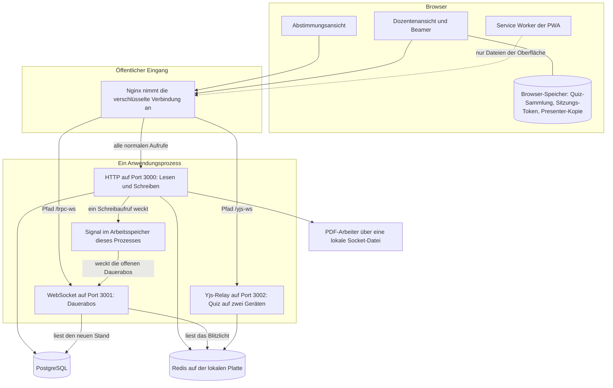
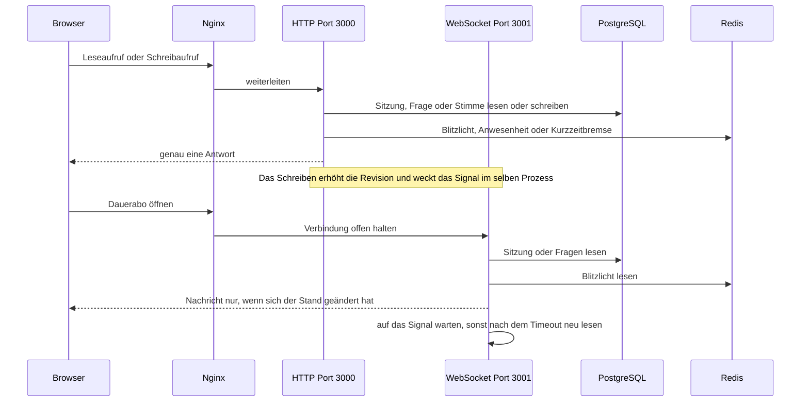
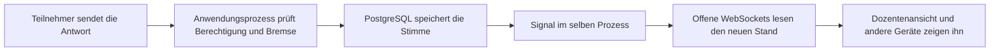
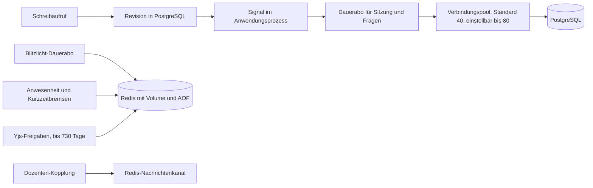

# Netzwerkplan: arsnova.eu

**Stand:** 2026-10-09

Dieser Plan beschreibt den Weg einer Live-Sitzung: vom Tippen in der Oberfläche
bis zur gespeicherten Stimme und zur Aktualisierung der anderen Geräte. Er gilt
für den einen Produktionsrechner. Eine zweite App-Instanz ist nicht im Betrieb.

Abgleich: `docker-compose.prod.yml`, `docs/deployment-debian-root-server.md`,
`docs/operations/MULTI-INSTANCE-PLAN.md`, `apps/frontend/src/app/core/trpc.client.ts`,
`apps/frontend/ngsw-config.json`, `apps/backend/src/lib/databasePoolConfig.ts`,
`apps/backend/src/lib/yjsShareToken.ts`,
`apps/frontend/src/app/core/host-session-token.ts`,
`apps/frontend/src/app/features/session/session-present/session-token-storage.service.ts`.

## Begriffe

| Begriff             | Bedeutung                                                                                                                                         |
| ------------------- | ------------------------------------------------------------------------------------------------------------------------------------------------- |
| Oberfläche          | Die Angular-Seite im Browser. Teilnehmer sehen die Abstimmungsansicht, der Dozent die Steuerung, der Beamer die Präsentation.                     |
| TLS                 | Transport Layer Security. Die Verbindung im Browser ist verschlüsselt. Die Adresse beginnt mit `https://`.                                        |
| Nginx               | Der einzige öffentlich erreichbare Prozess. Er nimmt die verschlüsselte Verbindung an und leitet sie intern weiter.                               |
| HTTP                | Hypertext Transfer Protocol. Ein Aufruf, eine Antwort, danach ist der Vorgang zu Ende.                                                            |
| WebSocket           | Eine Verbindung, die offen bleibt. Der Server kann später von sich aus eine Nachricht schicken.                                                   |
| tRPC                | Die Programmierschnittstelle der App. Der Browser ruft benannte Funktionen auf. Er erfindet keine eigenen Adressen.                               |
| Leseaufruf          | In tRPC eine Query. Holt einen Stand und ändert ihn nicht.                                                                                        |
| Schreibaufruf       | In tRPC eine Mutation. Ändert einen Stand und liefert genau eine Antwort.                                                                         |
| Dauerabo            | In tRPC eine Subscription. Läuft über die WebSocket und meldet spätere Änderungen.                                                                |
| PostgreSQL          | Die maßgebliche Datenbank. Sitzungen, Fragen und Quiz-Stimmen bleiben hier.                                                                       |
| Revision            | Ein Zähler an der Sitzung. Er steigt bei einer fachlichen Änderung um eins. Die wartenden Geräte erkennen daran, dass sie neu lesen müssen.       |
| Redis               | Ein zweiter Speicher auf demselben Rechner. Er ist schnell und schreibt mit. Er ist nicht die maßgebliche Datenbank.                              |
| AOF                 | Append Only File. Redis hängt jedes Schreibkommando an eine Datei auf der Platte.                                                                 |
| WAITAOF             | Redis bestätigt einen Schreibvorgang erst, wenn diese Datei geschrieben wurde.                                                                    |
| Yjs                 | Bibliothek, mit der zwei Browser dasselbe Quiz gleichzeitig bearbeiten. Die Änderungen fließen über ein eigenes Relay.                            |
| PWA                 | Progressive Web App. Die Seite kann sich wie eine installierte Anwendung öffnen.                                                                  |
| Service Worker      | Ein Hintergrundskript im Browser. Hier legt es nur die Anwendungsdateien in einen Zwischenspeicher.                                               |
| IndexedDB           | Eine Datenbank im Browser, getrennt vom Speicher des Servers.                                                                                     |
| Sitzungsspeicher    | `sessionStorage`. Gilt nur für diesen Browser-Tab und verschwindet, wenn der Tab geschlossen wird.                                                |
| EventEmitter        | Ein Signal im Arbeitsspeicher eines Prozesses. Andere Prozesse hören es nicht.                                                                    |
| Verbindungspool     | Eine kleine Menge offener Datenbankverbindungen, die sich alle Aufrufe teilen. Nicht jeder Browser bekommt eine eigene Verbindung.                |
| Zeitkritischer Pfad | Der Weg, der während der Veranstaltung kurz sein muss: Stimme speichern und die anderen Bildschirme nachziehen. Im Englischen heißt das Hot Path. |
| TTL                 | Time to live, die Ablaufzeit eines Eintrags.                                                                                                      |

## Was die Oberfläche auslöst

| Ansicht                          | Was die Person tut                     | Was dabei über das Netz geht                                                                                        |
| -------------------------------- | -------------------------------------- | ------------------------------------------------------------------------------------------------------------------- |
| Beitritt                         | Code eingeben und Platz nehmen         | Ein Schreibaufruf legt die Teilnahme an. Danach öffnet die Abstimmungsansicht ihre Dauerabos.                       |
| Abstimmungsansicht               | Antwort wählen                         | Ein Schreibaufruf speichert die Stimme. Der Stand der Frage kommt über das Dauerabo, nicht über ständiges Abfragen. |
| Dozentenansicht                  | Nächste Frage, Sperre, Sitzungsende    | Schreibaufrufe ändern die Sitzung und erhöhen die Revision. Die offenen Dauerabos ziehen die anderen Geräte nach.   |
| Beamer-Ansicht                   | Dieselbe Sitzung auf einem zweiten Tab | Der Tab übernimmt für höchstens 30 Minuten eine Kopie des Dozenten-Tokens aus dem Browser.                          |
| Blitzlicht                       | Stimmung oder Tempo abgeben            | Die Stimme liegt in Redis. Das Dauerabo liest sie und meldet nur eine Änderung.                                     |
| Fragenkanal                      | Frage stellen oder unterstützen        | Schreibaufruf nach PostgreSQL. Die Liste aktualisiert sich über das Dauerabo.                                       |
| Quiz auf zwei Geräten bearbeiten | Text auf Gerät A ändern                | Yjs schickt die Änderung an das Relay. Gerät B sieht sie, ohne die Live-Sitzung zu berühren.                        |

Der Service Worker gehört nicht zu diesen Wegen. Er liefert nur die schon
geladenen Dateien der Oberfläche, wenn das Netz kurz aussetzt. Eine neue Stimme
kommt nie aus diesem Zwischenspeicher.

## 1. Weg vom Browser zu den Diensten

Auf dem Produktionsrechner laufen getrennte Prozesse. Nur Nginx ist von außen
erreichbar. Die drei Ports der App sind an `127.0.0.1` gebunden, also nur an
diesen Rechner selbst.

Der Dozenten-Tab hält sein Token im Sitzungsspeicher. Eine zweite Datenbank im
Browser, `arsnova-host-tokens`, legt davon eine Kopie für den Beamer-Tab ab und
löscht sie nach 30 Minuten. Die Yjs-Sammlung in IndexedDB enthält die lokalen
Quizze, nicht die Stimmen der laufenden Sitzung.

## 2. Lesen, Schreiben, Zuschauen

Ein Leseaufruf und ein Schreibaufruf gehen über HTTP und enden nach einer
Antwort. Ein Dauerabo geht über die WebSocket. Mehrere Dauerabos einer Seite
teilen sich diese eine Verbindung: Sitzungsstand, Fragen und Blitzlicht.

Sitzungsstand und Fragen warten auf das Signal. Bleibt es aus, lesen sie
trotzdem neu: der Sitzungsstand nach 10 Sekunden in einer laufenden Quizphase
und nach 30 Sekunden im Leerlauf, die Fragen nach 15 Sekunden. Das Blitzlicht
hat kein solches Signal. Sein Dauerabo liest Redis alle 0,5 Sekunden bei
offener Runde und alle 1,2 Sekunden, wenn die Runde gesperrt ist oder in der
Diskussion steht. An den Browser geht nur eine Nachricht, wenn sich der Inhalt
geändert hat.

Fällt das Dauerabo aus, fragt die Abstimmungsansicht den Stand alle 2 Sekunden
über HTTP nach. Solange die WebSocket gesund ist, gibt es diesen Takt nicht.
Unabhängig davon meldet die Abstimmungsansicht einmal pro Minute, dass der
Teilnehmer noch anwesend ist.

## 3. Der zeitkritische Pfad

Während der Veranstaltung zählt vor allem dieser Weg. Er soll kurz bleiben,
auch wenn viele Geräte gleichzeitig antworten.

Denselben Weg nimmt die Dozentenaktion „nächste Frage“. Der Schreibaufruf erhöht
die Revision. Jedes wartende Dauerabo liest danach einmal und zeichnet die
Oberfläche neu. Es gibt dafür keine Abfrage im Sekundentakt.

Nicht auf diesem Pfad liegen der PDF-Arbeiter, die öffentliche Landing-Seite
und der Zwischenspeicher der PWA. Der PDF-Arbeiter hängt per Socket-Datei am
HTTP-Prozess und baut Berichte. Die Landing-Seite steht auf einem anderen Host.

Der 2-Sekunden-Takt ist ein Ersatz, kein normaler Schritt des zeitkritischen
Pfads. Er entsteht erst, wenn ein Dauerabo abbricht. Viele Geräte gleichzeitig
in diesem Ersatz erhöhen die Last auf demselben Verbindungspool.

## 4. Wo der Stand liegt

PostgreSQL ist die maßgebliche Quelle für Sitzung, Fragen und Quiz-Stimmen. Die
Revision ist der Merkzettel: das Schreiben erhöht sie, das Dauerabo vergleicht
sie. Ist die Zahl gleich geblieben, geht keine Nachricht an den Browser.

Redis liegt auf demselben Rechner. Das Volume `redis_data` und das AOF-Protokoll
machen die Einträge lokal dauerhaft. Yjs-Freigaben bleiben bis zu 730 Tage.
Bestätigte Schreibvorgänge in der Produktion warten auf `WAITAOF`, also auf die
Bestätigung, dass das Protokoll auf der Platte liegt. Anwesenheit und
Kurzzeitbremsen laufen früher ab. Fällt Redis aus, fehlen Blitzlicht, Freigaben
und Bremsen auch dann, wenn PostgreSQL unversehrt ist. Ein Backup an einem
anderen Ort ist Redis damit nicht. Die maßgebliche Datenbank bleibt PostgreSQL.

Der Verbindungspool öffnet standardmäßig 40 Verbindungen zu PostgreSQL.
`DATABASE_POOL_MAX` erlaubt 4 bis 80. Ein Wert außerhalb dieses Bereichs fällt
auf 40 zurück. PostgreSQL selbst lässt in der üblichen Installation etwa 100
Verbindungen zu. Die restlichen bleiben für Verwaltung und Kontrolle frei.

Nachrichten über Redis wecken heute die Dozenten-Kopplung und die
Sitzungsbereinigung. Sitzungsstand und Fragen nutzen das nicht. Ihr Signal lebt
nur im Anwendungsprozess. Ein zweiter Prozess auf einem anderen Rechner würde
es nicht hören.
