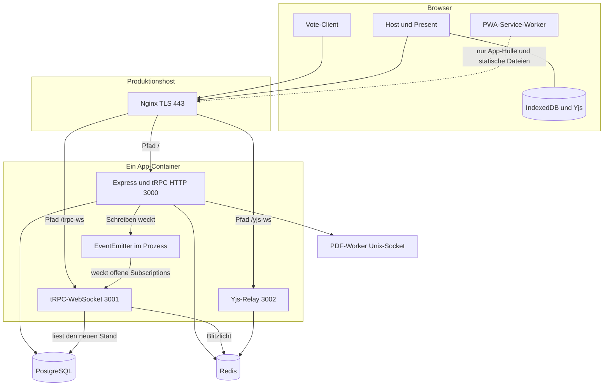
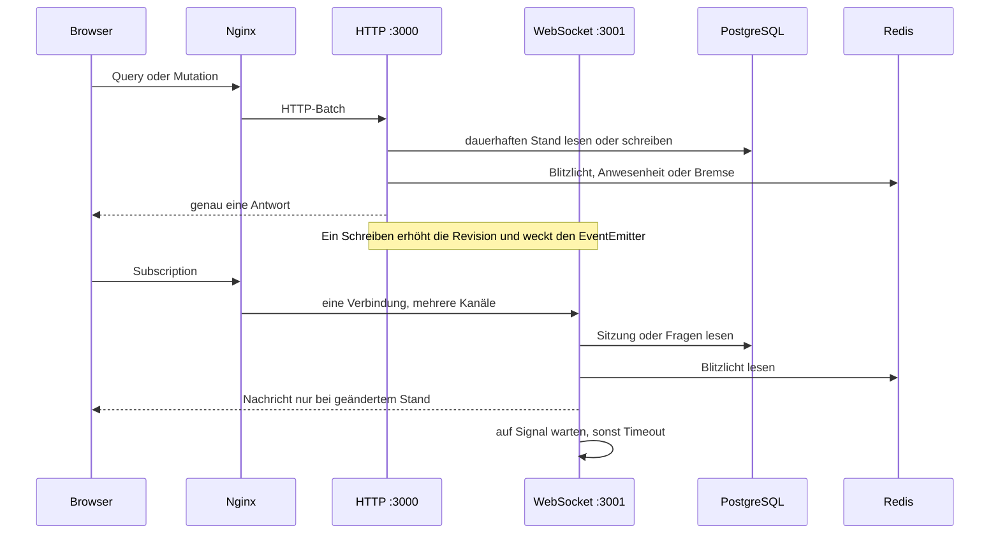
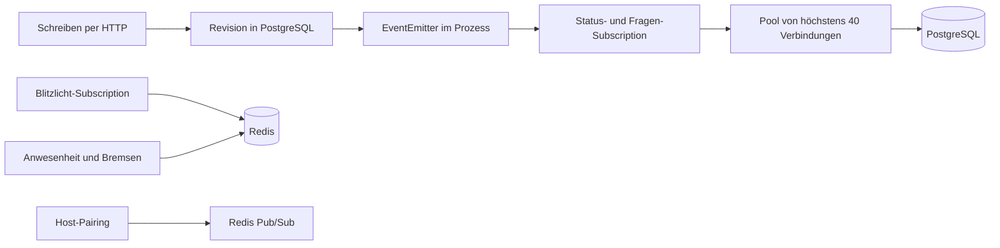

# Netzwerkplan: arsnova.eu

**Stand:** 2026-10-09

Ein Produktionshost. Nginx beendet TLS und verteilt auf einen App-Container.
PostgreSQL hält den dauerhaften Stand, Redis den flüchtigen. Live-Signale
bleiben im Speicher dieses einen Node-Prozesses.

Abgleich: `docker-compose.prod.yml`, `docs/deployment-debian-root-server.md`,
`docs/operations/MULTI-INSTANCE-PLAN.md`, `apps/frontend/src/app/core/trpc.client.ts`,
`apps/frontend/ngsw-config.json`.

## 1. Weg vom Browser zu den Diensten

Die Ports 3000, 3001 und 3002 sind nur an `127.0.0.1` gebunden. Von außen ist
nur Nginx erreichbar. Der Service Worker läuft nur im Produktionsbuild und
liefert keine Sitzungsdaten. IndexedDB hält die lokale Quiz-Sammlung, nicht die
Live-Stimmen.

## 2. Lesen, Schreiben, Zuschauen

Queries und Mutations enden nach einer Antwort. Eine Subscription bleibt offen.
`session.onStatusChanged` und `qa.onQuestionsUpdated` warten auf den
prozesslokalen EventEmitter und lesen danach PostgreSQL neu. Der Timeout beträgt
10 oder 30 Sekunden für den Status und 15 Sekunden für Fragen.
`quickFeedback.onResults` hat kein Signal. Sie liest Redis alle 0,5 Sekunden bei
offener Runde und alle 1,2 Sekunden bei Sperre oder Diskussion.

Fällt die Subscription aus, startet der Vote-Client den HTTP-Fallback alle
2 Sekunden. Im gesunden Betrieb läuft dieser Takt nicht. Der Presence-Heartbeat
bleibt davon unabhängig: ein HTTP-Aufruf alle 60 Sekunden.

## 3. Wo der Stand liegt

Die Revision ist der Merkzettel. Das Schreiben erhöht sie in PostgreSQL, das
Zuschauen vergleicht sie. Redis-Pub/Sub weckt heute das Host-Pairing und die
Sitzungsbereinigung, nicht den Status- oder Fragenkanal. Ein zweiter
App-Prozess würde diese Signale nicht hören.

Der PDF-Worker hängt per Unix-Socket am HTTP-Prozess und liegt außerhalb der
Live-Kanäle. Die Landing-Seite liegt nicht auf diesem Host.
